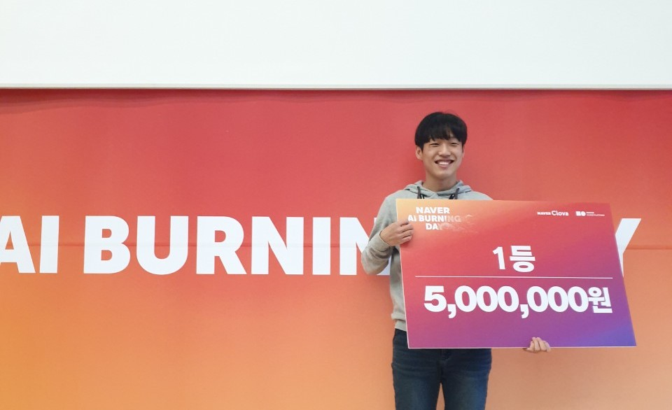
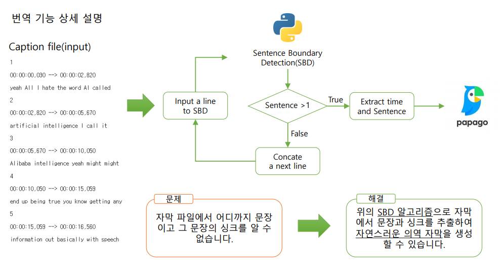

# BTS (Best Translation Service)
유튜브 한국어 자막 제공 웹 서비스
> [Naver AI Burning Day](https://campaign.naver.com/aihackathon_ai_burning/) (네이버 클라우드 플랫폼 AI API를 활용한 웹 또는 앱을 개발하는 해커톤)를 통해서 제작된 프로젝트입니다.

유튜브의 한국어 자동생성 자막은 문법적으로 시청자가 이해하기 어려운 번역체를 제시한다는 단점이 있어, Papago NMT를 활용하여 자연스럽고 이해하기 쉬운 한국어 자막을 제공함으로써 문제를 해결하고자 한다.

## Demo
대회기간 동안만 임시로 운영했으며 docs/demo.avi로 데모영상을 볼 수 있다. 
~~[Demo](http://#) 현재 데모 사이트는 유튜브 영상 길이 5분 이하에서 원활하게 동작한다.~~

## Award

## How?
> 유튜브 영상은 자막을 자동으로 생성하는 기능이 있으며 API를 제공한다. 음성인식을 통해 해당 영상의 언어 자막을 제공하거나, 이를 번역한 자막을 볼 수 있다. 본 프로젝트에서는 영어 영상에 대해서 유튜브가 제공하는 한국어 자동번역보다 영어 음성인식의 성능이 월등히 좋다는 전제가 있다.

유튜브 영상으로부터 영어 자막을 가져와 이를 PapagoNMT를 돌려 자연스러운 한국어 자막을 제공한다. 자연스러운 번역을 위해 문장단위로 번역해야하지만 <b>유튜브에서 가져온 영어 자막에 온점(.)이 없다.</b>

[SBD (Sentence Boundary Detection)](https://en.wikipedia.org/wiki/Sentence_boundary_disambiguation) 자연어 처리를 통해 온점(.)이 없더라도 문장을 분할하여 PapagoNMT에게 전달한다. SBD는 [DeepSegment](https://github.com/notAI-tech/deepsegment) 오픈 소스를 활용하였다.

위 그림처럼 유튜브 자막 제공 API에서 주는 단위(line)별로 가져와 문장이 1개 이상이라면 PapagoNMT에게 전달하고, 그렇지 않으면 문장을 구성할 때까지 다시 한 line을 누적시킨다. 이를 통해 단순한 단어들의 나열이 아닌, 문장이 PapagoNMT에게 전달되고 자연스러운 의역 자막이 생성되는 것이다.

## Team
<b>구륙</b>
- 장민호
- 김태형
- 채지훈
- 김동진